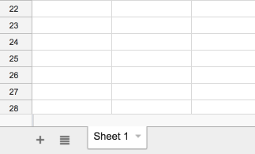
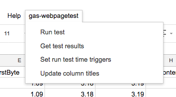
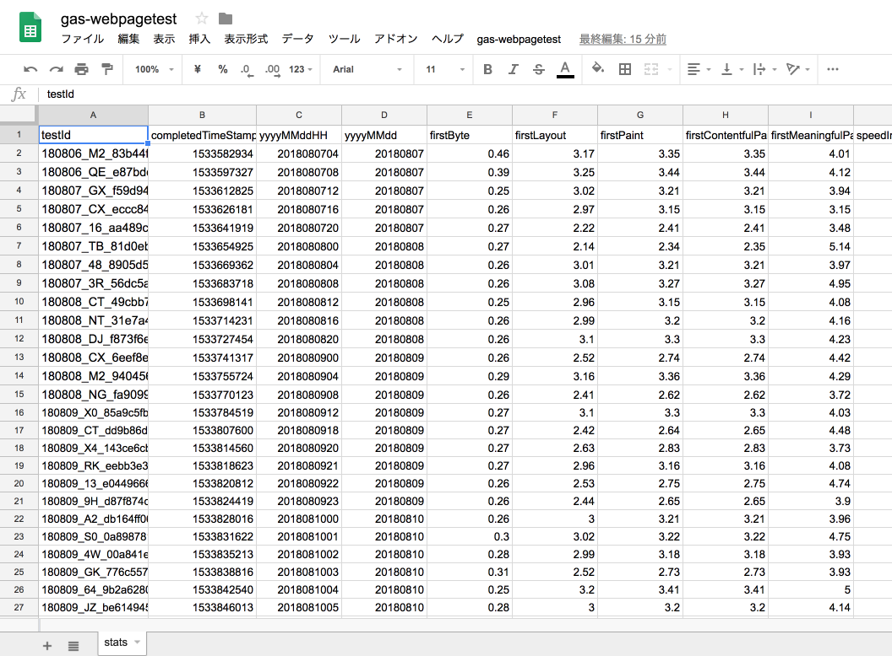
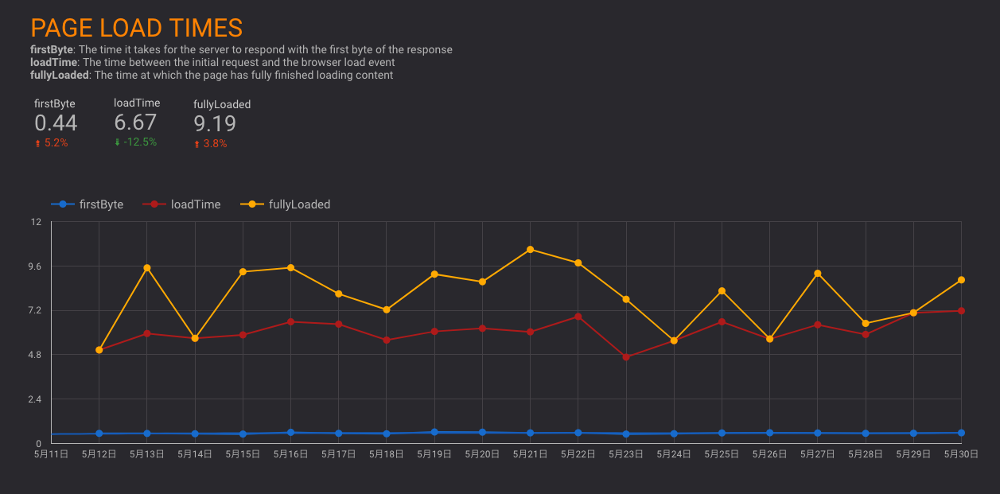

# gas-webpagetest

> ### *You can't control what you can't measure.*
> Tom DeMarco (1982) Controlling Software Projects.

This [Google Apps Scripts](https://developers.google.com/apps-script/) help to measure your website using [WebPagetest](https://www.webpagetest.org/).

## Requirements

- Node.js
  - This script is written by Node.js
- [Yarn](https://yarnpkg.com/)
  - package manager
  - This repository is managed by Yarn
- Google Account
  - Need to login with [clasp](https://github.com/google/clasp).
  - `gas-webpagetest` is a Google Apps Script.
- Google Spreadsheet
  - `gas-webpagetest` record the result of WebPagetest to Google Spreadsheet
  - 1 sheet = 1 site
- WebPagetest API Key
  - [WebPagetest - Get API Key](https://www.webpagetest.org/getkey.php)
  - `gas-webpagetest` call WebPagetest API and record it.

### Optional

- [Google DataStudio](https://datastudio.google.com/)
  - It help to visualize your data

## Usage

### Installation

1. git clone this repository

```
git clone https://github.com/uknmr/gas-webpagetest.git
cd gas-webpagetest
```

2. Install dependencies by yarn


```
yarn install
```


3. If you never use `clasp`, please do `clasp login`

```
yarn clasp login
# Login and Authorize clasp
```

### Integrate Google Spreadsheet with Google Apps Script(`gas-webpagetest`)

4. Create empty spreadsheet that is recorded result of WebPagetest.
  - You should copy spreadsheet id
  - For example, your spreadsheet url is `https://docs.google.com/spreadsheets/d/asn__asxScJZi-2asd4242sd23HO441Ok/edit#gid=0`
  - `asn__asxScJZi-2asd4242sdHOeB6t5XFdOk` is a **spreadsheet id** and copy it
  
5. Create new Google Apps Script and connect it your spreadsheet.

Run following command:

```
yarn run create-gas "<script title>" "<spreadsheet id>"
# Example
# yarn run create-gas "gas-webpagetest" "asn__asxScJZi-2asd4242sdHOeB6t5XFdOk"
```

`yarn run create-gas` command's arguments:

- 1st argument is Google Apps Script title
- 2nd argument is **spreadsheet id**

:memo: If you met following error, you have to visit the url and enable the Apps Script API.

> Error: Permission denied. Enable the Apps Script API:
> https://script.google.com/home/usersettings

6. Configure `.env` file

You have to change these values of `.env` file.

- `WEBPAGETEST_API_KEY`: WebPagetest API key
    - Get from [WebPagetest - Get API Key](https://www.webpagetest.org/getkey.php)
- `RUN_TEST_URL`: Test target URL
- `SHEET_NAME`: The name of Google Spread Sheet
    - Sheet Name is bottom the spread sheet
    - 

```.env
# WebPagetest API Key
## See https://www.webpagetest.org/getkey.php
WEBPAGETEST_API_KEY=<your api key>
# Test Target URL
RUN_TEST_URL=https://example.com
# Run Test interval
## Set run test interval by using Google Apps Script Time-Based Trigger
## Execute runTest function every RUN_TEST_INTERVAL
## Example:
## `2h`, `1h`, or `30m`
## Limitation:
## - Can not combine hour with minutes
##   - `1h30m` => Error
## - Allow to set one of `1m`, `5m`, `15m`, `30m` as minutes
RUN_TEST_INTERVAL=30m
# Sheet name to record
SHEET_NAME=Sheet1

# WebPagetest Options
# https://sites.google.com/a/webpagetest.org/docs/advanced-features/webpagetest-restful-apis
## Number of test runs (1-10 on the public instance)
## gas-webpagetest use median results
....
```


7. Deploy the `gas-webpagetest` script to your Google Apps Script: `yarn run deploy`

Run following command that deploy this apps script.

```
yarn run deploy
```

## Setup schedule for `gas-webpagetest` script

`gas-webpagetest` provide these functions and you can invoke these functions from spreadsheet's menu.



- Run Test
  - Run test that call WebPagetest API
- Get Test results
  - Get results of the test and write it to spreadsheet
- Update column titles
  - Update spreadsheet title columns

These functions can be called manually.  
However, These functions can be regularly called by **Time Trigger**.

So, you can set **Time Trigger** by the following function.

- Set run test time triggers
  - You can set time trigger like cron
  - By default, it is per 30 minutes

### Setup  at first time 

0. Visit your google spread sheet
1. Invoke "Update column titles" from spread sheet's menu
2. Invoke "Set run test time triggers" from spread sheet's menu
3. Complete!

After that, `gas-webpagetest` run tests per 30 minutes and put the results to your spreadsheet.



## Optional: Visualization

[Google DataStudio](https://datastudio.google.com) visualize your spreadsheet data.

1. [Connect your spreadsheet](https://datastudio.google.com/data) to [Google DataStudio](https://datastudio.google.com)
2. Open [Template Project](https://datastudio.google.com/open/16CAqnC3ErfJ_B0UypUq4zQzYdReuW24i)
3. Click "Create new report from the copy" on menu
    - Use your connected data


